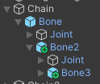
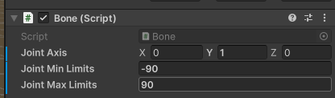
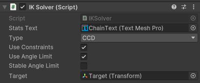
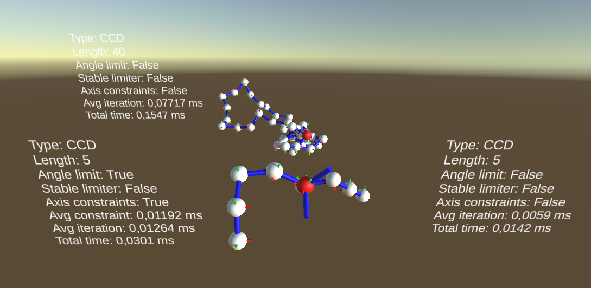
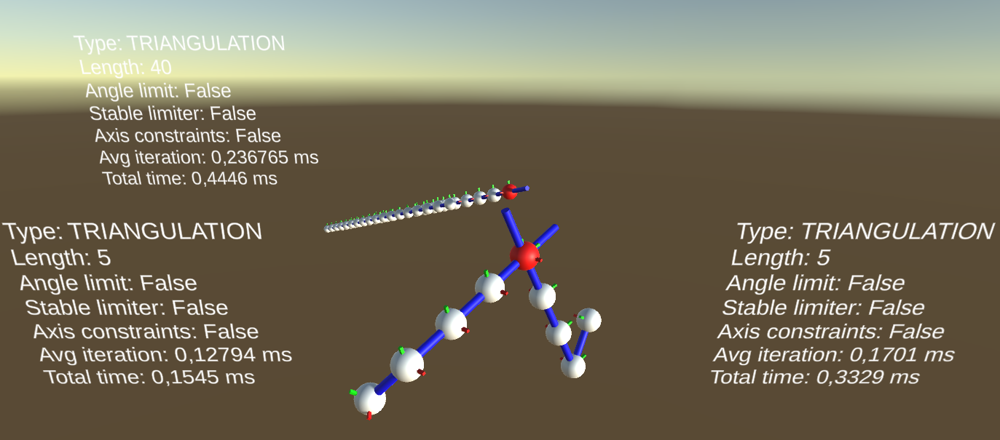

# Inverse Kinematics

## <h2 id="top">Summary</h2>
-[Currently implemented](#implements)  
-[WIP](#wip)  
-[Instructions](#instructions)  
-[Benchmark](#benchmark)  
-[Screenshots](#screens)  
-[References](#references)  

## <h2 id="implements">Currently implemented</h2>
CCD Algorithm  
CCD Axis constraints  
CCD Angle constraints  
Time Benchmarking  

## <h2 id="wip">WIP</h2>
Triangulation improvement on CCD  
Angular Benchmarking (total angle moved, avg angle movement...)  
FABRIK  
FABRIK constraints  
Support for skeletal meshes  
Annealing for CCD (raises the chance of success)  
CCD 5-Dof optimization (more natural, faster by the looks of it, only mention found [here](https://zalo.github.io/blog/inverse-kinematics/#bonus-direction))  

## <h2 id="instructions">Instructions</h2>
Z/Q/S/D to move the target (red ball) horizontally, space/lshift to go up/down. All three chains should try to point towards a target, the long chain having its own separate target to make viewing the movements on the small chains easier.  

**Bones and chain setup:**  
A chain starts with a game object that contains the script "IK Solver". Then, you must add bone prefabs in a hierarchical order to form the body of your chain. The chain is automatically formed on Start.  
By moving the bones in the scene, you can vary the length of each bone, but it is recommended to keep (0, 0, 2) as the local position vector for each bone, so that visuals match the chain. You can rotate each bon to get a different starting chain from the same bones.  
Here, "Chain" contains the solvern, and each bone is a child of the previous bone.  
   

To setup constraints on a bone, you can just check the "Bone" script in the inspector. You can set the axis that defines the bone's rotation, as well as the range it can rotate around. With my implementation, this range should be between -180° and 180°. And axis of (0, 0, 0) means no constraints will be applied. A range like ]-180; 180[ should mean no angle constraint around the axis.  
   

**Chain Inspector:**  
When clicking on a chain, you can find the IK Solver component. This is where you can setup the solver's parameters.  
  
- "Type" changes the type of the solver, currently CCD and Triangulation, however triangulation is not working currently.  
- "Use Constraints" will enable the axis constraint on the chain, making each joint rotate around its defined axis. If a bone has an axis of (0, 0, 0), no constraint will be applied.  
- "Use Angle Limit" will enable the angular limit of the chain's bones. This has no effect if "Use Constraints" is not enabled.  
- "Stable Angle Limit" will change the calculations of the angle limit to use an implementation I found on one of my sources. This implementation is slightly slower and used mostly to compare my own implementation, and produces different results by default as the angles used by it are in range [0; 360] where I use [-180; 180].  
- "Target" is the transform the chain is targetting. There is no safety check to see if this field is empty.  
- "Stats Text" is the text object the chain will write to. There is no safety check to see if this field is empty.  

## <h2 id="benchmark">Benchmark</h2>

Benchmarks have been done on each chain present in the scene. The only configuration not tested was using Triangulation, as the algorithm, while implemented as the papers should say, does not give correct results.  
The names in this table are the name of the chain in the hierarchy. In every test, the target has been placed in a spot that the chain can reach.  
"Chain" has constraints in every bone, "Chain2" has constraints in every bone except the 3rd and 5th (last), and "LongChain" has constraints in every bone except every 5th bone.  

|           | CCD, No constraint                                       | Triangulation, No constraint                              | CCD, Axis Constraint                                         | CCD, My Angular                                                                             | CCD, Angular Stable                                                                                 |
|-----------|----------------------------------------------------------|-----------------------------------------------------------|--------------------------------------------------------------|---------------------------------------------------------------------------------------------|-----------------------------------------------------------------------------------------------------|
| Chain     | Average iteration: 0.005ms Total: 0.013 - 0.015ms     | Average iteration: 0.13 - 0.14ms Total: 0.20 - 0.22 ms | Average iteration: 0.007 - 0.009ms Total: 0.020 - 0.022ms | Average constraint: 0.01ms Average iteration: 0.01ms Total: 0.025 - 0.027ms           | Average constraint: 0.010 - 0.012ms Average iteration: 0.010 - 0.012ms Total: 0.025 - 0.030ms |
| Chain2    | Average iteration: 0.005ms Total: 0.013 - 0.014ms     | Average iteration: 0.14 - 0.15ms Total: 0.26 - 0.27ms  | Average iteration: 0.005 - 0.006ms Total: 0.018 - 0.020ms | Average constraint: 0.005ms Average iteration: 0.007 - 0.008ms Total: 0.020 - 0.023ms | Average constraint: 0.005 - 0.006ms Average iteration: 0.007 - 0.008ms Total: 0.021 - 0.024ms |
| LongChain | Average iteration: 0.06 - 0.07ms Total: 0.12 - 0.13ms | Average iteration: 0.22 - 0.26ms Total: 0.43 - 0.52ms  | Average iteration: 0.08 - 0.10ms Total: 0.16 - 0.18ms     | Average constraint: 0.08ms Average iteration: 0.09 - 0.11ms Total: 0.19 - 0.20ms      | Average constraint: 0.09 - 0.10ms Average iteration: 0.11 - 0.12ms Total: 0.22 - 0.23ms       |  

As we can see, there is a massive increase in total time as the chain gets longer, but also in the time spent per iteration. We also see that having bones without constraints can significantly reduce the time spent computing the chain. Triangulation produces worse results than CCD on small chains due to its heavy calculations for its rotations, however its cost growth is steady as only a few bones actually have to rotate.  

## <h2 id="screens">Screenshots</h2>

  
Two chains solved using CCD. The left chain has axis and angle constraints enabled, the right chain hasn't.    

  
This is how the scene looks like in play mode. The texts display the current settings of a chain and the time it takes to solve in real time.  

  
This is how Triangulation looks when solving a chain. It looks very inorganic but is very optimized, and thus is mostly used with mechanic chains.

## <h2 id="references">References</h2>

#### CCD:  
Base CCD:  
- https://disigns.wordpress.com/portfolio/solving-inverse-kinematics/  
- https://zalo.github.io/blog/inverse-kinematics/  
- https://github.com/zalo/zalo.github.io/blob/master/assets/js/IK/IKExample.js  

Stable Implementation:
- https://github.com/zalo/MathUtilities/blob/master/Assets/Constraints/Constraints.cs  
- https://github.com/zalo/MathUtilities/blob/master/Assets/IK/CCDIK/CCDIKJoint.cs  

#### Triangulation:  
- https://digital.liby.waikato.ac.nz/conferences/ivcnz07/papers/ivcnz07-paper34.pdf  
- https://core.ac.uk/download/pdf/82473611.pdf  

[Top of the page](#top)
