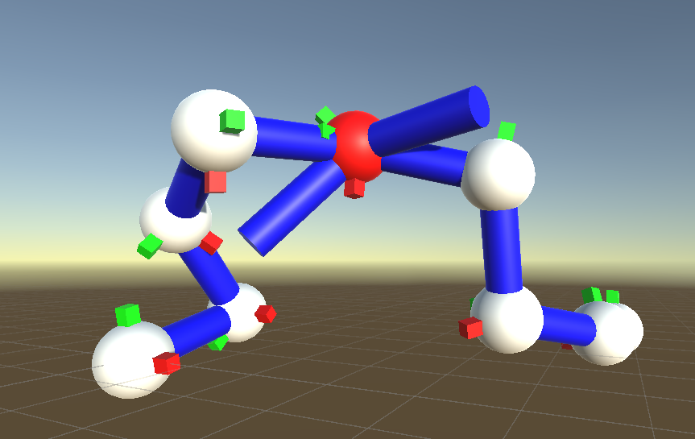

# Inverse Kinematics

## <h2 id="top">Summary</h2>
-[Currently implemented](#implements)  
-[WIP](#wip)  
-[Instructions](#instructions)  
-[Screenshots](#screens)  
-[References](#references)  

## <h2 id="implements">Currently implemented</h2>
CCD Algorithm  
CCD Axis constraints  
CCD Angle constraints  

## <h2 id="wip">WIP</h2>
Triangulation improvement on CCD  
Benchmarking utilities (time/total rotation)  
FABRIK  
FABRIK constraints  
Support for skeletal meshes  
Annealing for CCD (raises the chance of success)  
CCD 5-Dof optimization (more natural, faster by the looks of it, only mention found [here](https://zalo.github.io/blog/inverse-kinematics/#bonus-direction))  

## <h2 id="instructions">Instructions</h2>
Z/Q/S/D to move target horizontally, space/lshift to go up/down.  

## <h2 id="screens">Screenshots</h2>

  
Two chains solved using CCD. The left chain has axis and angle constraints enabled, the right chain hasn't.    

## <h2 id="references">References</h2>

#### CCD:  
Base CCD:  
- https://disigns.wordpress.com/portfolio/solving-inverse-kinematics/  
- https://zalo.github.io/blog/inverse-kinematics/  
- https://github.com/zalo/zalo.github.io/blob/master/assets/js/IK/IKExample.js  

Stable Implementation:
- https://github.com/zalo/MathUtilities/blob/master/Assets/Constraints/Constraints.cs  
- https://github.com/zalo/MathUtilities/blob/master/Assets/IK/CCDIK/CCDIKJoint.cs  

#### Triangulation:  
- https://digital.liby.waikato.ac.nz/conferences/ivcnz07/papers/ivcnz07-paper34.pdf  
- https://core.ac.uk/download/pdf/82473611.pdf  

[Top of the page](#top)